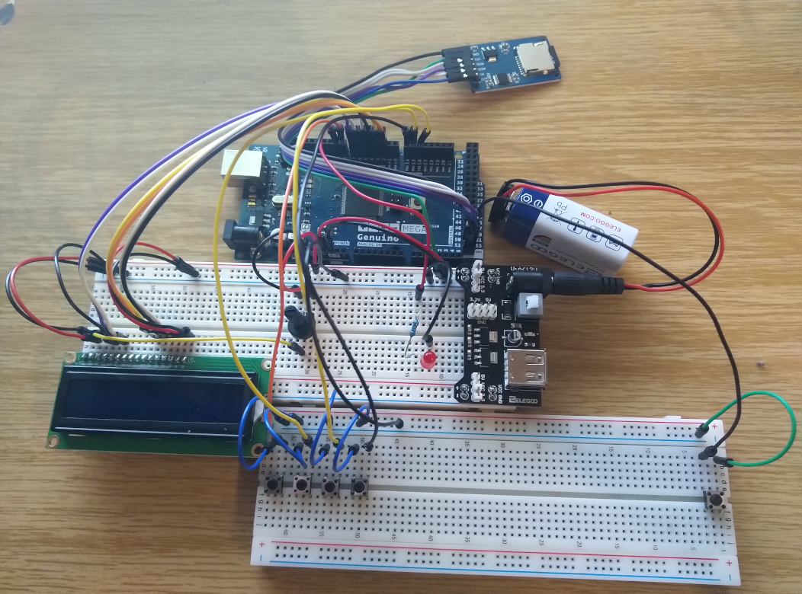

# saufautomat
A small arduino project to keep track of all the beverages you drink. 

## Pins

This code was written for Arduino/Genuino Mega 2560. Other models might require different pin configurations.

The status LED (or busy indicator) is connected to pin 9. This LED is not required to run the project.

### LCD

- D4 --> 2
- D5 --> 3
- D6 --> 4
- D7 -->  5

### Buttons

- Beer --> 16
- Shots --> 15
- Non-alcoholic --> 14
- Longdrinks --> 8
- Reset --> 49
- Debug Terminal --> 10

### SD-Card

These are the default SPI pins for the Mega 2560 and the CS pin.

- MOSI --> 51
- MISO --> 50
- SCK --> 52
- CS --> 49

## Example Build

This is roughly what your build may look like with some really basic bread boards and jumper cables.

